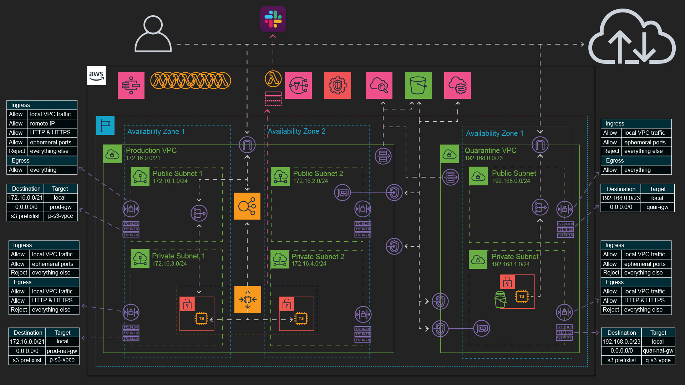

# Automated Incident Response and Forensic on AWS
This is an example of an automated incident response and forensic analysis on AWS using AWS GuardDuty, a StepFunction and Lambda functions. The CloudFormation template and code in this repository aim at providing everythin to:
* trigger improper security behavior on a web application, 
* see the event picked-up by GuardDuty
* execute as a response a StepFunction which will control an entire incident response and forensic workflow (details below)
* see the web application auto-heal from the incident
* receive basic snapshot and memory forensic analysis together with all the data to conduct deeper forensic analysis post-incident

# Credits
* This demo is primarily based on the demo released by Ben Potter (https://www.linkedin.com/in/benjipotter/) at AWS Summit London 2018: https://www.youtube.com/watch?v=f_EcwmmXkXk
The code of his demo is available here : https://github.com/awslabs/aws-security-automation/tree/master/EC2%20Auto%20Clean%20Room%20Forensics
* I also reused and modified a VPC CloudFormation template released by @Levon Becker for Stelligent available here: https://github.com/stelligent/cloudformation_templates/blob/master/infrastructure/vpc.yml
* I also reused shell scripts published by Ryan Holland https://www.linkedin.com/in/rcholland/ and Oliver Cahagne https://www.linkedin.com/in/ocahagne/ on AWS Labs to simulate security breaches to test GuardDuty: https://github.com/awslabs/amazon-guardduty-tester/blob/master/guardduty_tester.sh

# Demo envrionment

