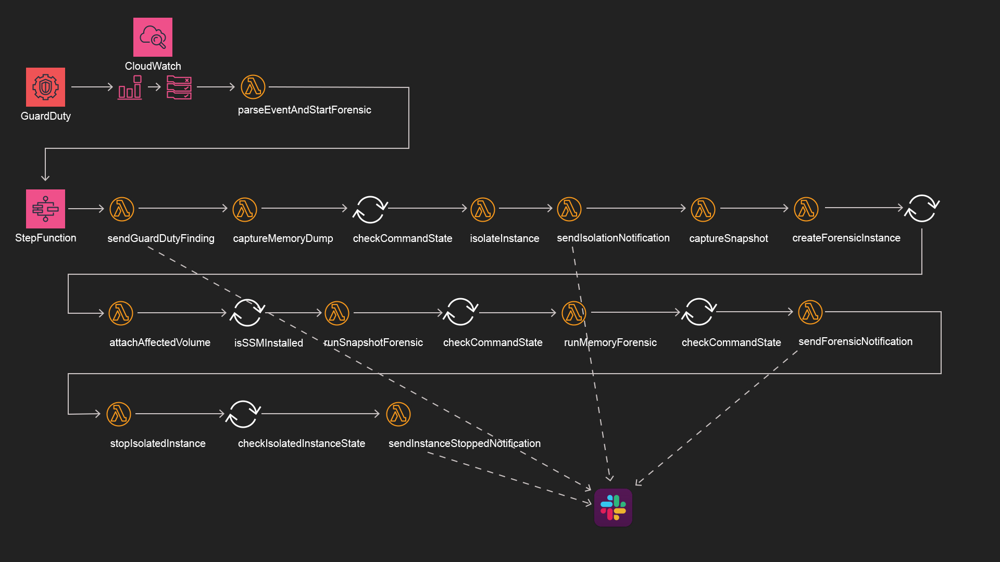

# Automated Incident Response and Forensic on AWS
This is an example of an automated incident response and forensic analysis on AWS using AWS GuardDuty, a StepFunction and Lambda functions. The CloudFormation template and code in this repository aim at providing everything to:
* trigger improper security behavior on a web application server, 
* see the event picked-up by GuardDuty
* execute as a response a StepFunction which will control an entire incident response and forensic workflow (details below)
* see the web application auto-heal from the incident
* receive basic snapshot and memory forensic analysis together with all the data to conduct deeper forensic analysis post-incident

# Credits
* This demo is primarily based on the demo released by Ben Potter at AWS Summit London 2018: https://www.youtube.com/watch?v=f_EcwmmXkXk
* The code of his demo is available here : https://github.com/awslabs/aws-security-automation/tree/master/EC2%20Auto%20Clean%20Room%20Forensics
* I also reused and modified a VPC CloudFormation template released by Levon Becker for Stelligent available here: https://github.com/stelligent/cloudformation_templates/blob/master/infrastructure/vpc.yml
* I also reused shell scripts published by Ryan Holland and Oliver Cahagne hon AWS Labs to simulate security breaches to test GuardDuty: https://github.com/awslabs/amazon-guardduty-tester/blob/master/guardduty_tester.sh

# Pre-requisties
* Activate AWS GuardDuty on your AWS account
* Have a Slack channel ready. Alerts will be send to that channel
* Download the two Lambda functions ZIP code (one is for the NginxWebApp YAML template, the other for the Forensic YAML tempalte) and save them into one of your S3 bucket.
* Create SSH Key Pairs for your EC2 instances (In the __EC2 console__, go to __Network & Security__ > __Key Pairs__)
* If you choose to enable VPC Flow Logs to S3, have a bucket ready for it
* Check the AMI name in your region of the AWS Ubuntu Server 18.04 LTS 

# The demo envrionment
This is the environment deployed by the 4 CloudFormation templates proposed here:
1. The production VPC 
2. The Quarantine VPC
3. The Nginx web application server
4. The incident response and forensic analysis StepFunction and Lambda functions

See for the explanation video: https://youtu.be/tUGf4uHOhCA

# The incident response and forensic analysis workflow 
This diagram represents the entire workflow deployed using the last CloudFormation template which uses a StepFunction and Lambda functions to perform the entire incident response and forensic analysis:
* notifying the administrators of the incident and the steps taken
* taking memory dump and EC2 instance snapshot
* installing a forensic instance
* performing memory snapshot and memory dump analysis
* exporting all data collected to S3
* stopping the misbehaving instance

Look at this video for the detailed explanation and the demo: https://youtu.be/Uis8vmlr_WI

# Deploying the Demo
## Step 1: deploy Private VPC template
* Deploy the __Production-VPC-template.yaml__ template
* Give a name to the deployment stack. You'll need to give that name as an input parameter for later templates
* You can choose to enable VPC Flow Logs to S3 and/or CloudWatch Logs

## Step 2: deploy Nginx web app template
* Deploy the __NginxWebApp-template.yaml__ template
* Give a name to the deployment stack. You'll need to give that name as an input parameter for later templates
* Provide the stack name used to deploy the Production VPC template

Note steps 2 and 3 can be inverted/performed simultaneously since they  do not depend on each other.
## Step 3: deploy Quarantine VPC template
* Deploy the __Quarantine-VPC-template.yaml__ template
* Give a name to the deployment stack. You'll need to give that name as an input parameter for the last template
* Provide the stack name used to deploy the Production VPC template

## Step 4: deploy Forensic template
* Deploy the __Forensic-template.yaml__ template
* Provide the stack names used to deploy the Production VPC template, the Quarantine VPC template and the NGinx web app template

# Disclaimer
The code provided in the Lambda functions performing the incident response and forensic analysis is written for AWS Ubuntu Server 18.04 LTS. If you choose a different Linux distribution, you will have to update at the minimum:
* the code in the NginxWebApp-template.yaml file, used to deploy and configure Nginx on the EC2 instance after launch
* the code in the captureMemoryDumpForForensic.py Lambda function to install LiME on the instance and perform the memory dump
* the code in the createForensicInstance.py to create the forensic instance in the Quarantine VPC and install all the tools (e.g. sleuthkit, vloatility...) to perform forensic analysis
* the code in the runSnapshotForensicAnalysis.py to launch commands using Systems Manager to perform the snapshot's forensic analysis
* the code in the runMemoryForensicAnalysis.py to launch commands using Systems Manager to perform the memory dump forensic analysis
